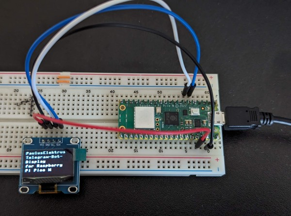

# Telegram-Bot-Display for Pico W

Dieses Projekt verwendet einen Raspberry Pi Pico und ein SSD1306 OLED-Display. Der Code ermöglicht die Kommunikation mit dem Telegram-Server und die Anzeige von Textnachrichten auf dem Display.

## Voraussetzungen

- Ein Raspberry Pi Pico
- Ein SSD1306 OLED-Display
- Zugang zu einem WLAN-Netzwerk
- Ein Telegram-Bot-Token
- Visual Studio Code mit [MicroPico Erweiterung](https://github.com/paulober/MicroPico)

## Installation

1. Schließen Sie das SSD1306 OLED-Display an den Raspberry Pi Pico an.

2. Stellen Sie sicher, dass Sie die erforderlichen Bibliotheken auf Ihrem Raspberry Pi Pico hochgeladen haben. Dies kann je nach Ihrem Setup variieren, aber normalerweise benötigen Sie den [MicroPython SSD1306 OLED driver für das Display](https://github.com/stlehmann/micropython-ssd1306/tree/master). Außerdem wird die [utelegram Library](https://github.com/jordiprats/micropython-utelegram/tree/master) benötigt. Beide Libraries sind im Projektordner enthalten.

3. Erstellen Sie eine Konfigurationsdatei `config.py`, in der Sie die WLAN-Zugangsdaten (`wifi_config`) und das Telegram-Bot-Token (`utelegram_config`) festlegen und laden Sie sie hoch.

   ```python
   # config.py
   wifi_config = {
       'ssid': 'Ihr WLAN-SSID',
       'password': 'Ihr WLAN-Passwort'
   }

   utelegram_config = {
       'token': 'Ihr Telegram-Bot-Token'
   }
   ```

5. Starten (REPL) oder uploaden Sie den main.py Code auf Ihren Raspberry Pi Pico.

## Verwendung

Sobald der Code auf Ihrem Raspberry Pi Pico ausgeführt wird und mit einem WLAN-Netzwerk verbunden ist, können Sie Ihren Telegram-Bot verwenden. Die folgenden Befehle stehen zur Verfügung:

- `/ping`: Sendet eine "pong"-Antwort zurück, um die Verbindung zu überprüfen.

- `/text Ihr Text hier`: Zeigt den eingegebenen Text auf dem SSD1306 OLED-Display an. Der Text wird automatisch umgebrochen, um sicherzustellen, dass er auf das Display passt.

Der Bot hört auf eingehende Nachrichten und führt die entsprechenden Aktionen aus.

## Hinweise

- Stellen Sie sicher, dass Sie die richtigen Zugangsdaten für das WLAN konfiguriert haben, indem Sie die Werte in Ihrer `config.py`-Datei aktualisieren.

- Dieses Projekt dient als einfaches Beispiel für die Verwendung eines Raspberry Pi Pico, eines SSD1306 OLED-Displays und eines Telegram-Bots. Sie können den Code anpassen und erweitern, um zusätzliche Funktionen und Anpassungen hinzuzufügen.

## Projektbild



## Dank an

- [paulober](https://github.com/paulober/MicroPico)

- [stlehmann](https://github.com/stlehmann/micropython-ssd1306/tree/master)

- [jordiprats](https://github.com/jordiprats/micropython-utelegram/tree/master)